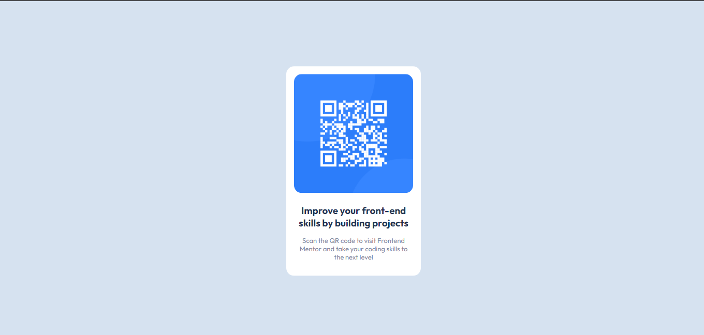

# Frontend Mentor - QR code component solution

This is a solution to the [QR code component challenge on Frontend Mentor](https://www.frontendmentor.io/challenges/qr-code-component-iux_sIO_H). Frontend Mentor challenges help you improve your coding skills by building realistic projects. 

## Table of contents

- [Overview](#overview)
  - [Screenshot](#screenshot)
  - [Links](#links)
  - [Built with](#built-with)
- [Author](#author)

## Overview
My second frontend mentor challenge.

### Screenshot

### Links

- Solution URL: [Git repo url](https://your-solution-url.com)
- Live Site URL: [Git live url](https://your-live-site-url.com)

### Built with

- HTML
- CSS custom properties

## Author

- Frontend Mentor - [@Plut0r](https://www.frontendmentor.io/profile/Plut0r)
- Linkedin - [@plut0r](www.linkedin.com/in/plut0r)
